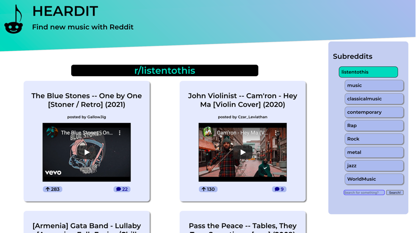

# HEARDIT - Find new music from Reddit

## Contents

- [Introduction](#intro)
- [Languages/Frameworks/Libraries Used](#languages)
- [Screenshots](#screenshots)
- [To Do](#todo)

## Introduction

This Web App was made in the context of a very loose Codecademy project as part of the **Full-Stack Engineer** program. The task was to make a Reddit client that took data from JSON files, displayed the data as posts and allowed users to search through the collected data and see comments to the posts.

My take on this idea was to make a Web App that allowed users to choose from a number of music-related subreddits and listen to the music posted there. It became clear quite quickly that the best way to do this would be to display YouTube links from Reddit, as this would allow users to click 'play' and immediately hear the music they wanted to hear, rather than using something like Spotify, which requires users to log in and might therefore be a slight annoyance (or a bigger annoyance if the user doesn't have an account). Thus, the JSON data from Reddit are filtered to take only posts that include a YouTube link, and the embed-id from the post's data is used to display the YouTube video.

## Languages/Frameworks/Libraries Used

- HTML
- CSS
- Javascript
- React (project initialised with _create-react-app_)
- React-Router
- React-Redux
- Redux Toolkit
- React Markdown

## Screenshots

### Full-Screen (Monitor)

### Mobile

## To Do

One thing that I had intended to do with this project is to use Jest/Enzyme to develop the App according to the principles of TDD. However, being quite unfamiliar with their use, I was finding trying to get to grips with those testing tools a bit overwhelming, and that was stopping me from getting started with the project in earnest. As a result, I aim to sort of work backwards and create the testing suite now that the project is more or less complete. I hope that having concrete, pre-established things to test for will allow me to understand how to go about the whole thing a bit better.

My original goal for this project was a bit more grand in scale - I wanted users to be able to select multiple subreddits at once so that a user who is interested, say, in jazz, rock, ambient music and math rock could see posts for all of those subreddits simultaneously. This is definitely an area for this project where there is a lot of room for development. Furthermore, at the moment, the coded-in subreddits are pretty limited; it would be good to be able to organise subreddits into categories and allow users to pick from almost the whole gamut of music-related subreddits. However, I think what I've presented is a reasonable proof-of-concept, and I hope to carry on expanding the project in the near future.
